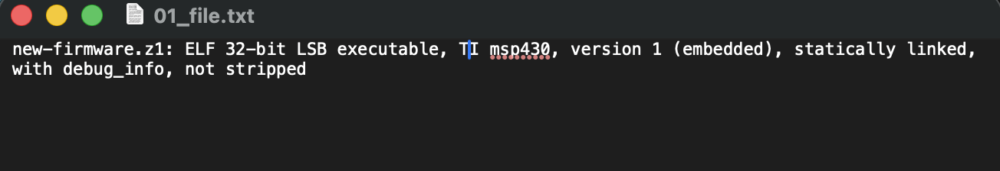
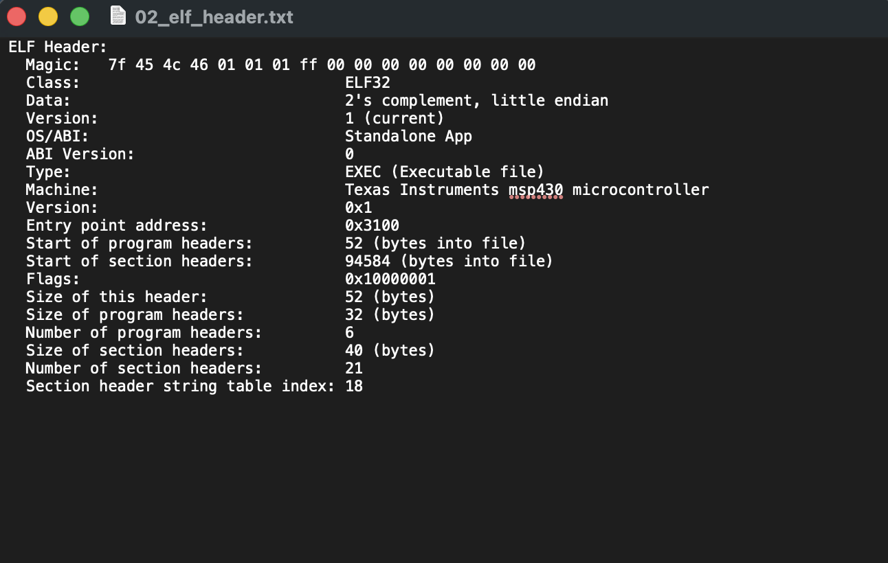
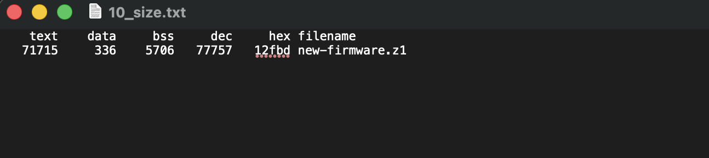
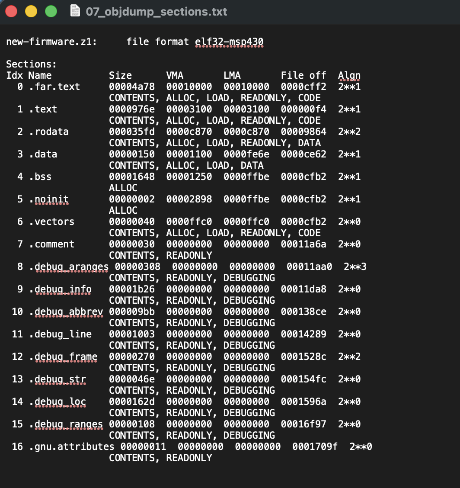

# MSP430 `.z1` / `.sky` / `ARM M4F(CC1352R)` / `cooja-native` Platformları için Üretilmiş Firmware’ler Üzerinde Yapılabilecek Analiz Türleri Kontrol Listesi

---
##### (* ARM Mimarisinde derlenmiş firmware analizi yapmak isteyen gruplar MSP430 Toolchain yanında ARM-Toolchain araçlarını da indirip, kullanmalıdırlar.)

``` bash
  $ wget https://armkeil.blob.core.windows.net/developer/Files/downloads/gnu-rm/9-2020q2/gcc-arm-none-eabi-9-2020-q2-update-x86_64-linux.tar.bz2
  $ tar -xjf gcc-arm-none-eabi-9-2020-q2-update-x86_64-linux.tar.bz2
```
---
##### ** Analiz etmeniz için farklı platformlarda oluşturulmuş örnek firmware arşivi bil.omu drive linki için [tıklayınız](https://drive.google.com/file/d/1oLrZWPmDyuznWe5qS7zOsfSyyyPcQbBG/view?usp=sharing) .


---

# 1. Binary Kimlik Analizi

Bu bölümde `new-firmware.z1`, `udp-client.z1` ve `udp-server.z1` firmware imajlarının temel dosya kimliği incelenmiştir. Analizde `file`, `msp430-readelf -h` ve `msp430-strings` araçları kullanılmıştır. Amaç, dosyaların hangi mimari için üretildiğini, hangi çalıştırılabilir formatı kullandığını, başlangıç adresini, endian bilgisini, ABI bilgisini ve debug/derleyici izlerini ortaya çıkarmaktır.

## Kullanılan Araçlar ve Amaçları

`file` komutu, firmware dosyasının genel türünü hızlıca belirlemek için kullanılmıştır. Bu komut sayesinde dosyanın ham veri mi yoksa çalıştırılabilir bir ELF imajı mı olduğu anlaşılır.

`msp430-readelf -h` komutu, ELF başlığını incelemek için kullanılmıştır. Bu başlık içerisinde ELF sınıfı, endian yapısı, hedef mimari, ABI bilgisi, giriş adresi ve program/section header bilgileri bulunur.

`msp430-strings` komutu, firmware içinde gömülü halde bulunan okunabilir metinleri, derleyici izlerini ve debug bilgilerini tespit etmek için kullanılmıştır.

## Hedef Platform ve Mimari

Analiz edilen üç dosya da `.z1` uzantılı firmware imajlarıdır. `.z1` dosyaları Contiki-NG ortamında Zolertia Z1 platformu için üretilen firmware dosyalarıdır. Bu platform MSP430 tabanlı olduğu için analizde MSP430 araç zinciri kullanılmıştır.

`file` ve `msp430-readelf -h` çıktıları incelendiğinde dosyaların hedef mimarisinin `Texas Instruments msp430 microcontroller` olduğu görülmüştür. Bu durum, firmware imajlarının ARM veya x86 için değil, MSP430 mikrodenetleyici mimarisi için üretildiğini göstermektedir.

## ELF Format Bilgisi

`file` komutu sonucunda `new-firmware.z1` dosyasının aşağıdaki şekilde tanımlandığı görülmüştür:

`ELF 32-bit LSB executable, TI msp430, version 1 (embedded), statically linked, with debug_info, not stripped`

Bu çıktı, firmware dosyasının ham binary veri olmadığını, 32-bit ELF çalıştırılabilir dosya formatında olduğunu göstermektedir. ELF formatı, yalnızca makine kodunu değil; section bilgilerini, sembol tablosunu, giriş adresini, mimari bilgisini ve debug bilgilerini de içerir.



**Şekil 1.** `file` komutu ile `new-firmware.z1` dosyasının ELF32 MSP430 executable olarak tespit edilmesi.

## Endianness Bilgisi

ELF başlığında `Data: 2's complement, little endian` bilgisi görülmüştür. Bu ifade, firmware dosyasının little-endian byte sıralamasına göre üretildiğini gösterir. Little-endian düzende çok baytlı veriler bellekte düşük anlamlı byte önce gelecek şekilde saklanır. Bu bilgi, firmware’in hedef işlemci mimarisiyle uyumlu biçimde derlendiğini anlamak için önemlidir.

## Entry Point Adresi

`msp430-readelf -h` çıktısına göre analiz edilen üç firmware dosyasının da giriş adresi `0x3100` olarak görülmektedir. Entry point, işlemcinin programı çalıştırmaya başladığında ilk komutları yürütmeye başlayacağı adresi ifade eder.

Bu projede `0x3100` adresinin ortak olması, `new-firmware.z1`, `udp-client.z1` ve `udp-server.z1` imajlarının aynı platform ve benzer linker yerleşimi hedeflenerek üretildiğini göstermektedir.



**Şekil 2.** `msp430-readelf -h` çıktısı ile `new-firmware.z1` dosyasının ELF sınıfı, endianness, ABI, hedef mimari ve giriş adresi bilgisinin gösterilmesi.

## ABI Bilgisi

ELF başlığında `OS/ABI: Standalone App` ve `ABI Version: 0` bilgisi yer almaktadır. Bu durum, firmware’in klasik masaüstü işletim sistemleri için değil, doğrudan gömülü sistem üzerinde çalışacak bağımsız bir uygulama imajı olarak üretildiğini gösterir. Yani dosya Linux, macOS veya Windows üzerinde çalışacak bir program değil; MSP430 tabanlı gömülü cihaz üzerinde çalışacak firmware imajıdır.

## Compiler ve Toolchain İzleri

`msp430-strings` çıktısında derleyiciye ait izler görülmektedir. Özellikle `GCC: (GNU) 4.7.2 20120920 (mspgcc dev 20120911)` benzeri ifadeler, firmware’in MSP430 için hazırlanmış GCC tabanlı araç zinciriyle derlendiğini göstermektedir.

Bu bilgi, firmware’in hangi derleyici ailesiyle oluşturulduğunu anlamak açısından önemlidir. Ayrıca dosya içinde derleyici ve bazı dizin izlerinin kalmış olması, firmware’in debug/analiz için daha fazla bilgi taşıdığını gösterir.

## Optimization Level Tahmini

Firmware dosyasından optimization seviyesini kesin olarak çıkarmak mümkün değildir. Ancak `file` çıktısında `with debug_info, not stripped` bilgisi görülmektedir. Bu durum, dosyanın debug bilgilerini ve sembolleri hâlâ içerdiğini gösterir. Eğer dosya tamamen optimize edilip küçültülmüş ve strip edilmiş olsaydı, sembol ve debug bilgileri büyük ölçüde kaldırılmış olurdu.

Bu nedenle firmware’in analiz edilebilirliği yüksektir. Fonksiyon isimleri, section bilgileri ve debug bölümleri korunmuş olduğundan reverse engineering ve statik analiz işlemleri daha kolay yapılabilmektedir.

## Debug Symbol Durumu

`file` çıktısındaki `with debug_info, not stripped` ifadesi, firmware imajının debug bilgilerini içerdiğini ve sembollerden arındırılmadığını göstermektedir. Ayrıca ELF section analizinde `.debug_info`, `.debug_line`, `.debug_str`, `.debug_frame`, `.debug_loc` ve `.debug_ranges` gibi debug bölümleri görülmektedir.

Bu debug bölümleri firmware’in çalışması için doğrudan gerekli değildir; ancak analiz sürecinde kaynak kod, fonksiyon, sembol ve adres ilişkilerinin anlaşılmasına yardımcı olur.

## Genel Sonuç

Binary kimlik analizi sonucunda `new-firmware.z1`, `udp-client.z1` ve `udp-server.z1` dosyalarının MSP430 mimarisi için hazırlanmış ELF32 çalıştırılabilir firmware imajları olduğu belirlenmiştir. Dosyalar little-endian yapıdadır, giriş adresleri `0x3100` olarak belirlenmiştir ve gömülü sistemler için `Standalone App` formatında üretilmiştir.

Bu sonuç, dosyaların yalnızca ham veri olarak değil, belirli bellek adreslerine yerleşmesi gereken yapısal firmware imajları olarak değerlendirilmesi gerektiğini göstermektedir. OTA aktarım senaryosunda bu bilgi önemlidir; çünkü firmware’in yalnızca ağ üzerinden taşınması değil, hedef sistemde doğru bellek bölgelerine nasıl yerleşeceğinin de anlaşılması gerekir.


# 2. Bellek Kullanım Analizi

Bu bölümde `new-firmware.z1`, `udp-client.z1` ve `udp-server.z1` firmware imajlarının bellek kullanımı incelenmiştir. Analizde temel olarak `msp430-size`, `msp430-readelf` ve `msp430-objdump` araçları kullanılmıştır. Amaç, firmware dosyalarının kod ve veri bölümlerinin Flash ve RAM üzerinde nasıl yer kapladığını anlamaktır.

## Kullanılan Araçlar ve Amaçları

`msp430-size` aracı, firmware imajının `text`, `data` ve `bss` alanlarının boyutlarını özet olarak verir. Bu çıktı, programın Flash ve RAM kullanımını hızlıca değerlendirmek için kullanılmıştır.

`msp430-readelf -S` ve `msp430-objdump -h` araçları ise firmware içerisindeki section yapısını ayrıntılı olarak görmek için kullanılmıştır. Bu sayede `.text`, `.data`, `.bss`, `.rodata` ve `.vectors` gibi bölümlerin hangi adreslere yerleştirildiği incelenmiştir.

## Flash, RAM, Stack ve Heap Kavramları

Gömülü sistemlerde Flash bellek, program kodunun ve sabit verilerin kalıcı olarak tutulduğu alandır. Cihaz kapansa bile Flash bellekteki veri kaybolmaz. Bu nedenle firmware içerisindeki çalıştırılabilir kodlar genellikle Flash üzerinde bulunur.

RAM ise program çalışırken kullanılan geçici bellektir. Global değişkenler, çalışma zamanında değişen veriler, stack ve bazı buffer alanları RAM üzerinde tutulur. Cihaz kapandığında RAM içeriği kaybolur.

Stack, fonksiyon çağrıları sırasında dönüş adresleri, geçici değişkenler ve register yedekleri için kullanılan bellek alanıdır. Heap ise dinamik bellek ayırma işlemleri için kullanılır. Bu firmware yapısında heap kullanımına dair doğrudan ayrı bir section gözlemlenmemiştir; Contiki-NG gibi gömülü işletim sistemlerinde bellek yönetimi çoğunlukla statik buffer yapıları ve önceden ayrılmış bellek havuzları üzerinden yapılır.

## `text`, `data` ve `bss` Boyutları

`msp430-size` çıktısına göre `new-firmware.z1` dosyasının bellek kullanımı aşağıdaki gibidir:



**Şekil 3.** `msp430-size` çıktısı ile `new-firmware.z1` dosyasının `text`, `data` ve `bss` bellek kullanım değerlerinin gösterilmesi.

`new-firmware.z1` dosyasında `text` alanı 71715 bayttır. Bu alan, çalıştırılabilir program kodunu ve bazı salt okunur verileri temsil eder. Gömülü sistem açısından bu alan ağırlıklı olarak Flash bellekte yer kaplar.

`data` alanı 336 bayttır. Bu bölüm, başlangıç değeri olan global ve statik değişkenleri içerir. `.data` bölümü Flash içinde başlangıç değeriyle saklanır; program çalışırken RAM’e kopyalanır. Bu nedenle `.data` hem Flash hem de RAM açısından dikkate alınmalıdır.

`bss` alanı 5706 bayttır. Bu bölüm, başlangıçta sıfır değerine sahip global ve statik değişkenler için ayrılan RAM alanıdır. `.bss` bölümü dosya içinde gerçek veri olarak büyük yer kaplamaz; fakat program çalışmaya başladığında RAM’de bu alan ayrılır ve sıfırlanır.

Not: Section çıktısında `.bss` bölümü `0x1648` yani 5704 bayt görünmektedir. Buna ek olarak `.noinit` bölümü 2 bayttır. `msp430-size` çıktısındaki `bss = 5706` değeri, çalışma zamanı RAM alanı olarak `.bss + .noinit` toplamı şeklinde değerlendirilebilir.

## Firmware Dosyalarının Boyut Karşılaştırması

Analiz edilen üç firmware dosyasının `msp430-size` sonuçları aşağıdaki gibidir:

| Firmware Dosyası  |  text | data |  bss |   dec |   hex |
| ----------------- | ----: | ---: | ---: | ----: | ----: |
| `new-firmware.z1` | 71715 |  336 | 5706 | 77757 | 12fbd |
| `udp-client.z1`   | 42871 |  336 | 5922 | 49129 |  bfe9 |
| `udp-server.z1`   | 42585 |  336 | 5866 | 48787 |  be93 |

Bu tabloya göre en büyük firmware imajı `new-firmware.z1` dosyasıdır. `new-firmware.z1` dosyasının `text` alanının diğer iki firmware dosyasına göre belirgin şekilde büyük olması, içerisinde daha fazla çalıştırılabilir kod ve sabit veri bulunduğunu göstermektedir.

`udp-client.z1` ve `udp-server.z1` dosyalarının boyutları birbirine oldukça yakındır. Bunun nedeni iki firmware’in aynı Contiki-NG altyapısını, aynı platform kütüphanelerini ve benzer ağ bileşenlerini kullanmasıdır. Aradaki küçük fark, uygulama seviyesindeki client/server görev farklılıklarından kaynaklanmaktadır.

## Section Dağılımı ve Memory Map Yorumu

Firmware imajında `.text`, `.far.text`, `.rodata`, `.data`, `.bss`, `.noinit` ve `.vectors` gibi temel section’lar bulunmaktadır. Bu section’ların görevleri bellek kullanımını anlamak açısından önemlidir.

| Section     | Bellek Karşılığı     | Görevi                                             |
| ----------- | -------------------- | -------------------------------------------------- |
| `.text`     | Flash                | Ana çalıştırılabilir kod bölümü                    |
| `.far.text` | Flash                | MSP430 genişletilmiş adres alanındaki kod bölümü   |
| `.rodata`   | Flash                | Sabit stringler ve değişmeyen veriler              |
| `.data`     | Flash + RAM          | Başlangıç değeri olan global/statik değişkenler    |
| `.bss`      | RAM                  | Başlangıçta sıfırlanan global/statik değişkenler   |
| `.noinit`   | RAM                  | Reset sonrası sıfırlanmaması istenen küçük alanlar |
| `.vectors`  | Flash / Vector alanı | Kesme ve reset vektörleri                          |

Bu dağılıma göre firmware’in çalıştırılabilir kod ve sabit veri bölümleri Flash üzerinde tutulur. Çalışma sırasında değişen veriler ise RAM üzerinde yer kaplar. Özellikle `.data` ve `.bss` bölümleri RAM kullanımı açısından önemlidir.

## Stack Kullanım Tahmini

`msp430-size` çıktısı doğrudan stack kullanımını göstermez. Stack kullanımı, çalışma zamanındaki fonksiyon çağrı derinliğine, kesme rutinlerine ve yerel değişken kullanımına bağlıdır. Ancak assembly çıktılarında görülen `push`, `pushm.a`, `calla` gibi komutlar, fonksiyon çağrıları ve ISR işlemleri sırasında stack kullanımının gerçekleştiğini göstermektedir.

Bu nedenle stack alanı, `.data` ve `.bss` dışında ayrıca RAM üzerinde yer tüketen dinamik bir çalışma zamanı alanı olarak değerlendirilmelidir.

## Heap Kullanımı

Analiz edilen ELF çıktılarında heap için belirgin ve ayrı bir section gözlemlenmemiştir. Bu durum, firmware’in klasik masaüstü uygulamalarındaki gibi yoğun dinamik bellek ayırma yapmadığını düşündürmektedir. Contiki-NG tabanlı gömülü sistemlerde bellek kullanımı genellikle statik buffer’lar, packetbuf yapısı ve önceden ayrılmış bellek havuzları üzerinden yönetilir.

Bu yaklaşım, sınırlı RAM’e sahip mikrodenetleyicilerde bellek taşması riskini azaltmak için tercih edilir.

## Büyük Veri Yapılarının Tespiti

`bss` alanının 5706 bayt olması, firmware içinde çalışma zamanında RAM’de yer ayıran global veya statik veri yapılarının bulunduğunu göstermektedir. Bu alan; ağ buffer’ları, komşu tabloları, zamanlayıcı yapıları, process kontrol yapıları ve Contiki-NG’nin sistem veri yapıları tarafından kullanılabilir.

Ayrıca `data` alanının 336 bayt ile küçük kalması, başlangıç değeri verilmiş global değişkenlerin sınırlı olduğunu; buna karşılık sıfırlanarak başlatılan çalışma zamanı verilerinin daha fazla yer kapladığını göstermektedir.

## Genel Değerlendirme

Bellek kullanım analizi sonucunda `new-firmware.z1` dosyasının en büyük bellek yüküne sahip firmware olduğu görülmüştür. `text` alanı ağırlıklı olarak Flash bellekte, `data` ve `bss` alanları ise çalışma zamanında RAM üzerinde karşılık bulmaktadır.

Bu sonuç OTA aktarımı açısından önemlidir. Çünkü aktarılacak firmware imajı yalnızca düz bir byte dizisi değildir; çalıştırılabilir kod, sabit veri, RAM’e yerleşecek değişkenler ve kesme vektörleri gibi farklı bölümlerden oluşur. Bu nedenle firmware aktarımı yapılırken yalnızca dosyanın gönderilmesi değil, dosyanın hedef sistemde hangi bellek alanlarına karşılık geldiğinin de anlaşılması gerekir.


# 3. Symbol / Function Analizi

```
furkann@DESKTOP-CPNNO3A:~/contiki-ng/examples/rpl-udp$ msp430-nm -n new-firmware.z1
         U gpio_hal_arch_init
         U spi_arch_has_lock
00000000 A __IE1
0000001a A __P3DIR
...
00001100 D __data_start
0000110c D cc2420_process
00001148 d mac_pan_id
...
00001250 B __bss_start
000014e6 B node_id
...
00003100 A __stack
0000313e T main
0000353e T port1_isr
00004034 t process_thread_cc2420_process
00004436 T cc2420_init
000079a0 T rpl_process_dio
...
0000ffc0 T __vectors_start
00010000 T _vectors_end
```

### **Kullanılan Araç Zinciri ve Analizin Amacı**

Bu analiz aşamasında, `new-firmware.z1` imajının içsel davranış modelini, bellek organizasyonunu ve yazılım mimarisini çözümlemek amacıyla MSP430 araç zincirinde bulunan `msp430-nm` ve `msp430-readelf` araçları kullanılmıştır. `nm `aracı ile firmware içindeki sembol tablosu (fonksiyonlar ve değişkenler) adres sırasına göre çözümlenmiş; `readelf -S` aracı ile de ELF formatının bölüm başlıkları (Section Headers) incelenerek yazılımın bellek uzayındaki stratejik yerleşimi doğrulanmıştır.

### **Fonksiyon isimleri**

Binary imaj içerisindeki çalıştırılabilir fonksiyonlar Flash bellek (`.text` ve `.far.text` segmentleri) üzerinde yer almaktadır. Sistem, işletim sistemini donanım seviyesinde başlatan `platform_init_stage_one` fonksiyonu ile ayağa kalkmakta ve `netstack_init` gibi fonksiyonlarla ağ hiyerarşisini kurmaktadır. `0x313e` adresinde konumlanan ana giriş noktası (`main`), sistemin temel çalışma döngüsünü başlatmaktadır.

### **Global değişkenler**

Sistem genelinden erişilebilen ve durum yönetimi için kritik olan global değişkenler RAM bölgesinde barındırılmaktadır. Analiz sonucunda ağ kimliğini tutan `mac_pan_id` (`0x1148`), düğümün eşsiz adresini belirten `node_id` (`0x14e6`) ve log seviyelerini kontrol eden `curr_log_level_main` (`0x1160`) gibi değişkenler tespit edilmiştir. Bu değişkenlerin **D** (Data) segmentinde yer alması, cihaza enerji verildiğinde bu değerlerin varsayılan başlangıç değerleriyle yüklendiğini göstermektedir.

### **Static değişkenler**

Yalnızca tanımlandıkları dosya (scope) içerisinden erişilebilen statik değişkenler, kapsülleme (encapsulation) ve bellek güvenliği amacıyla kullanılmıştır. Ağ paketlerinin zaman damgasını tutan `last_packet_timestamp` (`0x126c`) ve komşu düğümlerin bellek havuzunu yöneten `neighbor_memb` (`0x1118`) yapıları bu kategoriye girmektedir.

### **ISR (interrupt) fonksiyonları**

Cihazın dış dünyaya ve asenkron donanım olaylarına gerçek zamanlı tepki verebilmesi için Kesme Yöneticileri (ISR) kullanılmıştır. Sembol tablosunda yer alan `port1_isr` (`0x353e`) GPIO kesmelerini, `watchdog_interrupt` (`0x37d8`) sistem kilitlenmelerini denetleyen zamanlayıcıyı, `cc2420_timerb1_interrupt` (`0x35fe`) ise radyo entegresinden gelen sinyalleri işlemektedir. Bu ISR'ler, `0xffc0` adresinden başlayan donanımsal `.vectors` tablosuna kayıtlıdır.

### **Contiki process entry’leri**

İşletim sisteminin olay güdümlü (event-driven) yapısını oluşturan "thread" yapıları `process_thread_` ön ekiyle tespit edilmiştir. `process_thread_tcpip_process, process_thread_sensors_process ve process_thread_hello_world_process` sembolleri; firmware'in sensör okuması, ağ trafiği yönetimi ve ana uygulama görevlerini eşzamanlı (cooperative multitasking) bir yapı içerisinde yürüttüğünü kanıtlamaktadır.

### **Radio driver fonksiyonları**

Cihazın fiziksel haberleşme (PHY/MAC) katmanını yöneten radyo sürücüleri incelendiğinde, cihazın Texas Instruments CC2420 (2.4 GHz 802.15.4) çipini kullandığı saptanmıştır. `cc2420_init, cc2420_transmit` ve iletişim gücünün enerji verimliliği için dinamik ayarlanmasına olanak tanıyan `cc2420_set_txpower` fonksiyonları sürücü katmanının temelini oluşturmaktadır.

### **Timer callback’leri**

Sistemin görev zamanlaması ve asenkron beklemeler için Contiki'nin zamanlayıcı (Timer) kütüphanelerine yoğun biçimde başvurduğu görülmüştür. `etimer_expired, ctimer_set` ve donanım seviyesinde çalışan `rtimer_run_next` fonksiyonları; periyodik sensör okumalarının ve ağ beacon'larının (sinyallerinin) zamanında iletilmesini sağlamaktadır.

### **Networking callback’leri**

Ağ yığını (Network Stack) analiz edildiğinde, cihazın IPv6 ve RPL tabanlı bir yönlendirme şeması koşturduğu netleşmiştir. `uip_icmp6_input` IPv6 ICMP mesajlarını işlerken; rpl_process_dio, `rpl_process_dao` ve `rpl_dag_root_start` fonksiyonları cihazın ağaç topolojisinde (DAG) yönlendirme metrikleri hesapladığını ve bir yönlendirici (router) profiline sahip olduğunu göstermektedir.

### **Sensor handler’ları**

Düğümün çevreyle etkileşimini sağlayan donanım sensörlerine ait okuma rutinleri tespit edilmiştir. `tmp102_read_temp_x100` sembolü ortam sıcaklık sensörünün, `accm_read_axis` sembolü ise ADXL345 dijital ivmeölçerinin entegre edildiğini ve sistem tarafından veri toplamak amacıyla aktif olarak kullanıldığını doğrulamaktadır.

### **Kullanılan kütüphaneler**

Cihaz belleğinde standart C kütüphanelerinin (örneğin; bellek kopyalama için `memcpy`, dizgi formatlama için `printf/snprintf`) yanı sıra Contiki'ye özgü çekirdek kütüphaneler yer almaktadır. Özellikle RAM bloklarının yönetimi için `memb_init` ve dinamik bağlı listeler için `list_add` kütüphanelerinin yoğun kullanımı, sistemin kısıtlı bellek (RAM) kaynaklarını dinamik bir şekilde yönettiğine işaret etmektedir.

### **Kullanılmayan (dead) fonksiyonlar**

Geliştirme araç zincirinde, kod bloğunda bulunmasına rağmen programın hiçbir yerinde çağırılmayan (dead code) fonksiyonların analizi için ELF Section başlıkları (`readelf -S`) ve Sembol Tablosu incelenmiştir. Çıktıda `.text.fonksiyon_adi` şeklinde izole edilmiş fonksiyon blokları yerine, boyutları oldukça büyük tekil `.text` (0x976e) ve `.far.text` (0x4a78) blokları gözlemlenmiştir. Bununla birlikte, dosyada `.debug_info`, `.debug_line` gibi hata ayıklama (debug) sembollerinin tam boyutuyla tutulduğu (toplamda ~0x4000 byte civarı) görülmektedir. ELF dosyasının yapısı değerlendirildiğinde, bağlayıcı (Linker) aşamasında kullanılmayan kodların sistemden tamamen atılması işleminin (Dead Code Elimination / `--gc-sections`) bu binary dosyası oluşturulurken izole bir iz bırakmadığı anlaşılmıştır. Dolayısıyla, son ELF dosyasında "atılmış" fonksiyonların listesi, derleyici tarafından sessizce temizlendiği için doğrudan görünmemektedir.


### **Function Address Mapping (Fonksiyon Adres Haritalaması)**

`readelf -S` aracı ile elde edilen ELF Section başlıkları ve `nm` çıktıları birleştirilerek, yazılımın hedef cihazdaki nihai bellek haritası (Memory Map) aşağıda özetlenmiştir. Bu adres haritalaması, cihazın çalışma zamanında (runtime) vereceği olası "Crash (Çökme)" loglarındaki hata adreslerini çözümlerken referans alınacak ana yapı niteliğindedir.


| Bellek Bölgesi | Başlangıç Adresi | Bitiş Adresi | İçerik Tipi | Örnek Semboller |
|---|---|---|---|---|
| Donanım Register | `0x0000` | `0x10FF` | Mutlak Adresler | `__P1IN, __ADC12CTL0` |
| RAM (Data & BSS) | `0x1100` | `0x2898` | Değişkenler | `mac_pan_id, node_id` |
| Flash (Text/Kod) | `0x3100` | `0x14A78` | Çalıştırılabilir Kod | `main, cc2420_init` |
| Kesme Vektörleri | `0xFFC0` | `0x10000` | ISR (Interrupts) | `port1_isr, watchdog_interrupt` |


(Not: Temel çalıştırılabilir kodlar `.text` bölümünde `0x3100` adresinden başlarken, genişletilmiş kod blokları `.far.text` bölümünde `0x10000` adresinde saklanmaktadır. Salt okunur sabitler ise `0xc870` adresine yerleştirilmiştir.)


---

# 4. String ve Metadata Analizi

```
furkann@DESKTOP-CPNNO3A:~/contiki-ng/examples/rpl-udp$ msp430-strings new-firmware.z1
...
ADXL345 sensor
Accelerometer process
CC2420 driver
...
Starting Contiki-NG-release/v4.8-625-g8518cbaff-dirty
- 802.15.4 PANID: 0x%04x
- 802.15.4 Default channel: %u
Node ID: %u
Tentative link-local IPv6 address:
...
created a new RPL DAG
initialized DAG with instance ID %u, DAG ID
...
GCC: (GNU) 4.7.2 20120920 (mspgcc dev 20120911)
/home/user/tmp/gcc-4.7.2-msp430/msp430/mcpu-430x/mmpy-16/msr20/mc20/libgcc
...
```

### **Kullanılan Araç Zinciri ve Analizin Amacı**
Bu bölümde, derlenmiş firmware imajı (`new-firmware.z1`) içerisinde insan tarafından okunabilir (ASCII) metinleri, log formatlarını ve gömülü yapılandırma değerlerini ortaya çıkarmak amacıyla `msp430-strings` aracı kullanılmıştır. Bu araç, binary dosya içindeki ardışık yazdırılabilir karakterleri tarayarak yazılımın çalışma zamanında (runtime) konsola basacağı debug mesajlarını, ağ protokollerinin bıraktığı izleri ve donanım kimliklerini açığa çıkarmaktadır.

### **Debug Mesajları ve `printf` Logları**
Sistem içerisindeki metinler incelendiğinde, cihazın çalışma durumunu bildiren çok sayıda `INFO` (Bilgi) ve `WARN` (Uyarı) seviyesinde log tespit edilmiştir.

  * **Başlangıç İzleri:** Sistemin ayağa kalktığını gösteren `"Starting Contiki-NG-release..."` ve `"Hello, EK-D103"` gibi boot (başlatma) mesajları bulunmaktadır.

  * **Durum ve Hata Bildirimleri:** Radyo ve kuyruk yönetimine ait `"scheduling transmission in %u ticks", "packet sent to , seqno %u", "Neighbor queue full" ve "failed to create packet"` gibi metinler, sistemin MAC ve kuyruk (queuebuf) katmanında detaylı hata ayıklama (debug) verisi ürettiğini kanıtlamaktadır.

### **Ağ Parametreleri ve Protokol İzleri (IPv6, RPL, 6LoWPAN)**
Firmware'in ağ yetenekleri, kodun içine gömülmüş uyarı ve durum mesajları sayesinde kesin olarak doğrulanmıştır:

- **Fiziksel / MAC Katmanı:** `"- 802.15.4 PANID: 0x%04x"` ve `"- 802.15.4 Default channel: %u"` ifadeleri, IEEE 802.15.4 kablosuz standardının kullanıldığını göstermektedir.
- **RPL (Yönlendirme):** Cihazın RPL protokolündeki davranışlarını anlatan `"created a new RPL DAG", "initiating global repair", "DAG expired, poison and leave" ve "received a %s-DIO from"` gibi stringler yoğun bir şekilde yer almaktadır. Bu durum cihazın ağaç topolojisinde aktif bir yönlendirme aktörü (router) olduğunu doğrular.
- **IPv6 ve 6LoWPAN:** `"Tentative link-local IPv6 address:", "Sending ICMPv6 ERROR message" ve "reassembly: failed to store new fragment session"` mesajları, cihazın IPv6 yığınına sahip olduğunu ve büyük paketleri 6LoWPAN adaptasyon katmanında parçalayıp (fragmentation) birleştirdiğini kanıtlamaktadır.

### **İşletim Sistemi (Process) ve Sensör İsimleri**
Bir önceki sembol analizinde adresleri tespit edilen Contiki-NG işlemlerinin (processes) ve donanım bileşenlerinin, bellek içerisine gömülmüş string karşılıkları başarıyla çıkarılmıştır:
* **İşletim Sistemi Görevleri:** `"Hello world process", "TCP/IP process", "Ctimer process", "Event timer" ve "Accelerometer process".`
* **Donanım ve Sürücüler:** `"ADXL345 sensor"` (İvmeölçer), `"TMP102 sensor"` (Sıcaklık), `"Button"` (Fiziksel Tuş) ve haberleşme çipi olan `"CC2420 driver"` isimleri düz metin olarak kodda bulunmaktadır.

### **Hardcoded (Gömülü) Config Değerleri ve Geliştirici İzleri**
Geliştirme ortamına ve derleyiciye (Compiler) ait son derece kritik geliştirici izleri (metadata) saptanmıştır:

* **İşletim Sistemi Versiyonu:** Cihaza yüklenen Contiki-NG versiyonu `"Contiki-NG-release/v4.8-625-g8518cbaff-dirty"` olarak tespit edilmiştir. Buradaki *dirty* bayrağı (flag), derleme (compile) işlemi yapılırken Git deposunda henüz commit edilmemiş (kaydedilmemiş) değişiklikler olduğunu gösteren önemli bir detaydır.
* **Derleyici ve Dizin İzleri:** Kodu derleyen araç zincirinin versiyonu `"GCC: (GNU) 4.7.2 20120920 (mspgcc dev 20120911)"` ve asbmler versiyonu `"GNU AS 2.22"` olarak kodun içine kazınmıştır.
* **Geliştirici Bilgisayarı Yolları:** Derleme işleminin yapıldığı bilgisayarın mutlak dosya yolları (Absolute Paths) ELF formatında kalmıştır: `"/home/user/tmp/gcc-4.7.2-msp430/msp430/..."` ve `"/home/user/mspgcc-4.7.2/lib/gcc/msp430/..."`. Bu bilgi, firmware'in bir Linux ortamında ve "user" adlı bir kullanıcı dizininde derlendiğini kesin olarak ispatlamaktadır.

| Kategori | Tespit Edilen Örnek Metin (String) |	Yorum / Teknik Anlamı |
|---|---|---|
| Boot & İşletim Sistemi | `Starting Contiki-NG-release...` |	Sistemin başlangıç mesajı ve kullanılan OS versiyonu. |
| Fiziksel Ağ (MAC) | `- 802.15.4 PANID: 0x%04x` |	Cihazın `IEEE 802.15.4` kablosuz standardında çalıştığı kanıtlanmıştır. |
| Yönlendirme & IPv6 | `Tentative link-local IPv6 address: created a new RPL DAG` |	Cihazın IPv6 kullandığı ve RPL yönlendirme ağacı (DAG) oluşturabildiği görülmüştür. |
| Sensör & Donanım | `ADXL345 sensor CC2420 driver` |	İvmeölçer sensörünün ve radyo çipinin sürücü metinleridir. |
| Geliştirici İzleri | `GCC: (GNU) 4.7.2 /home/user/tmp/gcc-4.7.2...` |	Kodu derleyen GCC versiyonu ve derlemenin yapıldığı bilgisayarın mutlak dosya yoludur. |
---

# 5. Assembly / Instruction Analizi

```
furkann@DESKTOP-CPNNO3A:~/contiki-ng/examples/rpl-udp$ msp430-objdump -d new-firmware.z1 | grep -A 20 "<main>:"
0000313e <main>:
    313e:       b0 13 e4 6a     calla   #27364          ;0x06ae4
    3142:       b0 13 3a 45     calla   #17722          ;0x0453a
    3146:       b0 13 da aa     calla   #43738          ;0x0aada
    314a:       b0 13 7c 6d     calla   #28028          ;0x06d7c
    314e:       0e 43           clr     r14             ;
    3150:       3f 40 3c 11     mov     #4412,  r15     ;#0x113c
    3154:       b0 13 8e 6e     calla   #28302          ;0x06e8e
    3158:       b0 13 34 50     calla   #20532          ;0x05034
    315c:       b1 13 8a 3d     calla   #81290          ;0x13d8a
    3160:       b0 13 2a 51     calla   #20778          ;0x0512a
    3164:       b0 13 f2 bf     calla   #49138          ;0x0bff2
    3168:       b0 13 f6 6a     calla   #27382          ;0x06af6
    316c:       b0 13 dc 6e     calla   #28380          ;0x06edc
    3170:       b0 13 c2 68     calla   #26818          ;0x068c2
    3174:       b0 13 1c 69     calla   #26908          ;0x0691c
    3178:       b2 90 03 00     cmp     #3,     &0x1160 ;
    317c:       60 11
    317e:       0e 38           jl      $+30            ;abs 0x319c
    3180:       30 12 3a ca     push    #-13766 ;#0xca3a
    3184:       30 12 3f ca     push    #-13761 ;#0xca3f
```
```
furkann@DESKTOP-CPNNO3A:~/contiki-ng/examples/rpl-udp$ msp430-objdump -d new-firmware.z1 | grep -A 20 "<port1_isr>:"
0000353e <port1_isr>:
    353e:       3f 14           pushm.a #4,     r15     ;20-bit words
    3540:       f2 b0 40 00     bit.b   #64,    &0x0023 ;#0x0040
    3544:       23 00
    3546:       15 24           jz      $+44            ;abs 0x3572
    3548:       e2 b2 23 00     bit.b   #4,     &0x0023 ;r2 As==10
    354c:       12 20           jnz     $+38            ;abs 0x3572
    354e:       3f 40 54 12     mov     #4692,  r15     ;#0x1254
    3552:       b0 13 fc c6     calla   #50940          ;0x0c6fc
    3556:       0f 93           cmp     #0,     r15     ;r3 As==00
    3558:       32 24           jz      $+102           ;abs 0x35be
    355a:       3d 40 20 00     mov     #32,    r13     ;#0x0020
    355e:       0e 43           clr     r14             ;
    3560:       3f 40 54 12     mov     #4692,  r15     ;#0x1254
    3564:       b0 13 e0 c6     calla   #50912          ;0x0c6e0
    3568:       5f 42 23 00     mov.b   &0x0023,r15     ;0x0023
    356c:       7f f0 bf ff     and.b   #-65,   r15     ;#0xffbf
    3570:       18 3c           jmp     $+50            ;abs 0x35a2
    3572:       5f 42 23 00     mov.b   &0x0023,r15     ;0x0023
    3576:       4f 93           cmp.b   #0,     r15     ;r3 As==00
    3578:       1b 34           jge     $+56            ;abs 0x35b0
```
### Kullanılan Araç Zinciri ve Analizin Amacı 
Bu analizde, derlenmiş makine kodunu insan tarafından okunabilir Assembly diline çevirmek (Disassembly) amacıyla `msp430-objdump -d` aracı kullanılmıştır. Analizin temel amacı; fonksiyon çağrı yapılarını, donanım kesme (ISR) rutinlerinin CPU seviyesindeki davranışlarını, derleyici optimizasyonlarını ve işletim sistemine özgü bellek/zamanlayıcı geçişlerini makine komutları düzeyinde incelemektir.

### Instruction Sequence ve Function Call Graph Analizi
Sistemin ana döngüsü olan `main` fonksiyonunun başlangıcı incelendiğinde, programın doğrusal bir akış (sequence) yerine yoğun bir şekilde alt rutinlere (subroutine) dallandığı görülmüştür.
```
0000313e <main>:
    313e:       b0 13 e4 6a     calla   #27364          ;0x06ae4
    3142:       b0 13 3a 45     calla   #17722          ;0x0453a
    3146:       b0 13 da aa     calla   #43738          ;0x0aada
    ...
```
Yukarıdaki kesitte art arda gelen `calla` (Call Absolute) komutları, Contiki işletim sisteminin başlatma (boot) hiyerarşisini göstermektedir. İşlemci sırasıyla `0x06ae4` (`platform_init_stage_one`), `0x0453a` (`clock_init`) ve `0x0aada` (`rtimer_init`) gibi alt rutinlere zıplayıp geri dönmektedir. Bu durum, modüler bir **Call Graph** (Çağrı Grafiği) yapısının kanıtıdır.

### Register Kullanımı ve Function Prologue
Fonksiyonların başlangıcında, o anki donanım durumunu korumak amacıyla CPU yazmaçlarının (Register) Yığın (Stack) bölgesine yedeklenmesi (Prologue) işlemi gözlemlenmiştir.
```
    3180:       30 12 3a ca     push    #-13766 ;#0xca3a
    3184:       30 12 3f ca     push    #-13761 ;#0xca3f
```
`main` fonksiyonu içinde yer alan `push` komutları, fonksiyonun işleyişi sırasında üzerine yazılacak olan Register değerlerini veya yerel değişkenleri Stack uzayına atarak korumaya almaktadır.

###  ISR Akışı ve Context Switching (Bağlam Değişimi)
Donanımdan gelen bir kesmenin (Örneğin GPIO tetiklemesi) standart bir C fonksiyonundan ne kadar farklı çalıştığı `port1_isr` fonksiyonu üzerinden analiz edilmiştir.
```
0000353e <port1_isr>:
    353e:       3f 14           pushm.a #4,     r15     ;20-bit words
    3540:       f2 b0 40 00     bit.b   #64,    &0x0023 ;#0x0040
    ...
```
Normal fonksiyonlar tekil `push` komutlarıyla başlarken, ISR'nin `pushm.a #4, r15` (Push Multiple) komutuyla başlaması son derece kritiktir. Kesme geldiğinde CPU o an yaptığı işi aniden bırakmak zorundadır; bu nedenle 

tüm kritik yazmaçlar 20-bit boyutunda topluca yığına kopyalanarak "Bağlam Değişimi" (Context Switching) güvenli bir şekilde gerçekleştirilmiş olur.

### Donanım Register Etkileşimi (Hardware Access)
ISR bloğundaki `bit.b #64, &0x0023` komutu, doğrudan bir donanım adresine müdahaleyi gösterir. Bellek analizinde `0x0023` adresinin `__P1IFG` (Port 1 Interrupt Flag Register) olduğu bilinmektedir. Kesme yöneticisi, hangi pinden kesme geldiğini anlamak için bu donanım register'ındaki 6. biti (Değeri 64) test etmektedir.

###  Branch (Dallanma), Karar Yapıları ve Optimizasyon Analizi
Kod içerisindeki `if/else` karar yapılarının derleyici tarafından nasıl Assembly döngülerine çevrildiği ve optimize edildiği tespit edilmiştir.
```
    3178:       b2 90 03 00     cmp     #3,     &0x1160 ;
    317c:       60 11
    317e:       0e 38           jl      $+30            ;abs 0x319c
```
Burada `cmp` (Compare) komutu, RAM'deki `0x1160` adresinde bulunan `curr_log_level_main` değişkeninin değerini `3` sabiti ile karşılaştırmaktadır. Ardından gelen `jl` (Jump if Less) komutu, eğer log seviyesi 3'ten küçükse aradaki `push` komutlarını atlayarak doğrudan `0x319c` adresine dallanmaktadır. Bu tür mantıksal sıçramalar, gereksiz kod icrasını önleyen tipik derleyici optimizasyonlarıdır.

### Loop (Döngü) Davranışları
Benzer bir şartlı dallanma (Branching) durumu ISR içerisinde de görülmektedir.
```
    3556:       0f 93           cmp     #0,     r15     ;r3 As==00
    3558:       32 24           jz      $+102           ;abs 0x35be
```
Burada `r15` register'ındaki değer sıfır ise `jz` (Jump if Zero) komutu tetiklenmekte ve CPU kod bloğunda 102 byte ileriye (`0x35be` adresine) atlayarak bir karar döngüsünü (Loop) tamamlamaktadır. Bu yapı, C dilindeki `while()` veya `if()` bloklarının makine koduna dönüşmüş (expanded) halidir.

---

# 6. Source-Level Mapping Analizi

(Debug build varsa)

* Address → source line eşleme
* Function → source file eşleme
* ISR → source mapping
* Crash address çözümleme
* Optimization sonrası source mapping
* Inline edilmiş kodların tespiti

Araçlar:

* `msp430-addr2line`
* `msp430-objdump -S`
* `Ve üstteki araçların ARM versiyonları...`

# 7. ELF Yapısı Analizi

Bu bölümde `new-firmware.z1` firmware imajının ELF iç yapısı incelenmiştir. Analizde `msp430-readelf`, `msp430-objdump` ve `msp430-nm` araçlarından yararlanılmıştır. Amaç, firmware dosyasının yalnızca makine kodundan oluşmadığını; ELF header, section header, program header, symbol table, debug bölümleri ve kesme vektörleri gibi yapısal bilgiler taşıdığını göstermektir.

## Kullanılan Araçlar ve Amaçları

`msp430-readelf -h` komutu ELF başlığını incelemek için kullanılmıştır. Bu başlıkta dosyanın ELF sınıfı, mimarisi, endian yapısı, ABI bilgisi, giriş adresi ve section/program header bilgileri bulunur.

`msp430-readelf -S` komutu section header listesini görmek için kullanılmıştır. Bu komut sayesinde `.text`, `.data`, `.bss`, `.rodata`, `.vectors` ve `.debug_*` gibi bölümler tespit edilmiştir.

`msp430-readelf -l` komutu program header bilgilerini incelemek için kullanılmıştır. Program header bilgileri, dosyanın yükleme ve çalışma sırasında belleğe nasıl yerleştirileceği hakkında bilgi verir.

`msp430-objdump -h` komutu section’ların boyutlarını, başlangıç adreslerini ve dosya içindeki konumlarını görmek için kullanılmıştır.

## ELF Header Analizi

ELF header, firmware dosyasının kimlik bilgisini taşıyan ana başlıktır. `msp430-readelf -h` çıktısına göre `new-firmware.z1` dosyası `ELF32` sınıfındadır, little-endian yapıdadır ve hedef mimarisi `Texas Instruments msp430 microcontroller` olarak görülmektedir.

Aynı çıktıda giriş adresi `0x3100` olarak belirlenmiştir. Bu adres, firmware çalışmaya başladığında işlemcinin komut yürütmeye başlayacağı başlangıç noktasıdır. Bu bilgi firmware’in çalıştırılabilir bir yapıya sahip olduğunu gösterir.

## Section Header Analizi

ELF dosyasında farklı görevler için ayrılmış section’lar bulunmaktadır. Bu section yapısı, dosyanın ham binary olmadığını ve belleğe belirli kurallarla yerleşmesi gereken bir firmware imajı olduğunu gösterir.



**Şekil 4.** `msp430-objdump -h` çıktısı ile `new-firmware.z1` dosyasının ELF section yapısının gösterilmesi.

Çıktıda `.text`, `.far.text`, `.rodata`, `.data`, `.bss`, `.noinit`, `.vectors` ve `.debug_*` bölümleri görülmektedir. Bu bölümlerin her biri firmware içinde farklı bir göreve sahiptir.

| Section | Görevi |
|---|---|
| `.text` | Ana çalıştırılabilir kod bölümüdür. |
| `.far.text` | MSP430 genişletilmiş adres alanındaki çalıştırılabilir kodları içerir. |
| `.rodata` | Sabit stringler ve değişmeyen veriler burada tutulur. |
| `.data` | Başlangıç değeri olan global/statik değişkenleri içerir. |
| `.bss` | Başlangıçta sıfırlanan global/statik değişkenler için RAM alanıdır. |
| `.noinit` | Reset sonrası sıfırlanmaması istenen küçük bellek alanıdır. |
| `.vectors` | Kesme ve reset vektörlerini içerir. |
| `.debug_*` | Kaynak kod eşleme ve hata ayıklama bilgilerini içerir. |

## Program Header Analizi

Program header bilgileri, firmware dosyasının yüklenirken belleğe nasıl yerleştirileceği hakkında bilgi verir. Gömülü sistemlerde bu yapı, hangi bölümlerin Flash üzerinde kalacağını ve hangi bölümlerin çalışma sırasında RAM’e taşınacağını anlamak için önemlidir.

Örneğin `.text` ve `.rodata` gibi bölümler Flash üzerinde kalırken, `.data` başlangıçta Flash içinde saklanır ve çalışma sırasında RAM’e kopyalanır. `.bss` ise dosya içinde veri olarak büyük yer kaplamaz; program başlatılırken RAM’de ayrılır ve sıfırlanır.

## Symbol Table Analizi

ELF dosyasında sembol tablosu da bulunmaktadır. `msp430-readelf -s` ve `msp430-nm -n` çıktıları, firmware içindeki fonksiyonların, global değişkenlerin ve özel linker sembollerinin adreslerini gösterir.

Bu yapı sayesinde `main`, `port1_isr`, `cc2420_init`, `rpl_process_dio`, `__data_start`, `__bss_start` ve `__vectors_start` gibi semboller görülebilir. Bu semboller, firmware’in yalnızca düz makine kodu değil; fonksiyonlar, değişkenler ve bellek yerleşim bilgileri içeren yapısal bir ELF imajı olduğunu gösterir.

## Debug Sections ve DWARF Bilgisi

ELF section listesinde `.debug_info`, `.debug_line`, `.debug_str`, `.debug_frame`, `.debug_loc` ve `.debug_ranges` gibi debug bölümleri görülmektedir. Bu bölümler firmware’in çalışması için zorunlu değildir; ancak analiz, hata ayıklama ve kaynak kod-adres eşlemesi için önemlidir.

`file` çıktısında görülen `with debug_info, not stripped` bilgisi de bu durumu destekler. Yani firmware dosyası sembol ve debug bilgilerinden tamamen arındırılmamıştır.

## Startup Section ve Vector Table

`.vectors` bölümü MSP430 mimarisinde kritik öneme sahiptir. Bu bölüm `0xffc0` adresinde yer almakta ve kesme vektörlerini içermektedir. Reset veya donanımsal kesme oluştuğunda işlemcinin hangi adrese dallanacağını bu vektör tablosu belirler.

Bu nedenle `.vectors` bölümü, firmware’in başlangıç davranışı ve donanım olaylarına tepki verebilmesi açısından temel bir yapıdır.

## Genel Değerlendirme

ELF yapısı analizi sonucunda `new-firmware.z1` dosyasının yalnızca ham makine kodu taşımadığı görülmüştür. Dosya; ELF header, section header, program header, sembol tablosu, debug bölümleri ve kesme vektörleri gibi birçok yapısal bilgi içermektedir.

Bu yapı, firmware’in hedef MSP430 sisteminde hangi bellek bölgelerine yerleşeceğini ve çalışırken hangi bölümlerin Flash/RAM üzerinde kullanılacağını anlamayı sağlar. OTA aktarımı açısından bu bilgi önemlidir; çünkü taşınan dosya yalnızca byte dizisi değil, belirli bir mimari ve bellek düzeni için hazırlanmış çalıştırılabilir bir firmware imajıdır.

# 8. Interrupt ve Donanım Analizi

* Interrupt vector table
* GPIO access pattern
* Timer interrupt kullanımı
* UART ISR
* Radio interrupt handler
* ADC access
* Sensor polling
* Low-power mode geçişleri
* Clock configuration
* MSP430 register erişimleri

Araçlar:

* `msp430-objdump`
* `msp430-readelf`
* `Ve üstteki araçların ARM versiyonları...`

---

# 9. Networking Analizi

Bu bölümde, `new-firmware.z1` imajının ağ üzerindeki rolü, paket yönlendirme stratejileri ve MAC/Fiziksel katman etkileşimleri detaylı olarak incelenmiştir. Analizlerde `msp430-nm` ve `msp430-strings` araçlarından elde edilen veriler referans alınmıştır.

### Unicast kullanım tespiti
Ağdaki iki düğüm (node) arasında noktadan noktaya doğrudan iletişimi sağlayan Unicast haberleşme yapısı, firmware içerisinde aktif olarak kullanılmaktadır. `msp430-nm` çıktılarında tespit edilen `uip_ds6_route_lookup` ve `uip_ds6_route_nexthop` sembolleri, gelen paketlerin hedef IP adresine göre yönlendirme tablosunda eşleştirildiğini göstermektedir. Ayrıca `msp430-strings` çıktısındaki `"unicast DIS, reply to sender"` hata ayıklama mesajı, sistemin RPL protokolü kapsamında hedefi belli olan (unicast) mesajlar üretebildiğini kesin olarak ispatlamaktadır.

### Broadcast kullanım tespiti
Yönlendirme ağacı oluşturulurken (DAG) veya komşu keşif (Neighbor Discovery) aşamalarında ağdaki tüm düğümlere aynı anda ulaşmak için Broadcast mekanizması kullanılmaktadır. Sembol tablosunda açıkça görülen `frame802154_is_broadcast_addr` ve `packetbuf_holds_broadcast` fonksiyonları, MAC katmanında paketin hedef adresinin `0xFFFF` (`802.15.4` broadcast adresi) olup olmadığını denetler. Cihaz ağa ilk katıldığında yönlendirici bulmak amacıyla bu mekanizmaya sıklıkla başvurur.

### Multicast tespiti
IPv6 ağlarının bel kemiği olan Multicast (çoklu yayın) mekanizması, özellikle RPL protokolündeki ağ topolojisi mesajları için bu firmware'de aktif kılınmıştır. Sembol listesindeki `rpl_multicast_addr` değişkeni ve `msp430-strings` analizinde karşımıza çıkan `"invalid DAG MC"` ve `"sending a %s-DIO with rank %u to"` logları, cihazın spesifik bir gruba (Örneğin tüm RPL router'larına) çoklu yayın yapabildiğini göstermektedir.

### IPv6 stack kullanımı
Firmware, kısıtlı IoT cihazları için optimize edilmiş `Contiki uIP` (Micro IP) ve `uIPv6` yığınını barındırmaktadır. `uip_process`, `tcpip_process`, `uip_icmp6_input` ve `uip_ds6_init` sembolleri bu durumun temel kanıtlarıdır. Cihaz, IPv6 adreslemesini kullanırken, `802.15.4` radyo paketlerinin dar boyutuna (127 byte MTU) sığabilmek için `sicslowpan_init` sembolü ile tanımlanan **6LoWPAN** sıkıştırma (Header Compression) mimarisini koşturmaktadır. `msp430-strings` loglarındaki `"Tentative link-local IPv6 address:"` ibaresi cihazın kendi kendine IPv6 adresi atayabildiğini kanıtlar.

### RPL routing analizi
RPL (Routing Protocol for Low-Power and Lossy Networks), bu cihazın ana yönlendirme stratejisidir. `rpl_dag_root_start`, `rpl_process_dio` (DODAG Information Object) ve `rpl_process_dao` (Destination Advertisement Object) sembolleri, cihazın yönlendirme ağacında (DAG - Directed Acyclic Graph) bir rol üstlendiğini gösterir. Cihaz, çevresindeki düğümlerden DIO mesajları alarak köke (root) olan uzaklığını (Rank) hesaplamakta ve DAO mesajları göndererek kendi varlığını kök düğüme bildirmektedir. Loglardaki `"created a new RPL DAG"` ve `"significant rank update %u->%u"` mesajları RPL mekanizmasının tamamen aktif çalıştığını doğrular.

### TSCH scheduler çağrıları
Yapılan detaylı sembol tablosu (`msp430-nm`) analizinde, **TSCH** (Time Slotted Channel Hopping) planlayıcısına ait herhangi bir fonksiyon veya sembol (örneğin `tsch_process` veya `tsch_init`) tespit edilememiştir. Bu durum cihazın zaman senkronizasyonlu ve frekans atlamalı bir MAC katmanı kullanmadığını, paket gönderimlerinin slotlara (zaman dilimlerine) bölünmediğini açıkça göstermektedir.

### MAC layer interaction
Fiziksel katman ile ağ katmanı arasındaki köprüyü kuran MAC etkileşimleri, `802.15.4` standartlarına uygun olarak tasarlanmıştır. `framer_802154_create` ve `framer_802154_parse` sembolleri, IP paketlerine `IEEE 802.15.4` çerçeve başlıklarının (Frame Header) eklendiği ve çözüldüğü noktalardır. Ayrıca mac_sequence_init fonksiyonu ile MAC seviyesinde paketlere sıra numarası (Sequence Number) verilerek tekrar eden (duplicate) paketlerin MAC katmanında hızla reddedilmesi sağlanmıştır.

### Packet buffer kullanımı
Contiki-NG'nin RAM kısıtları nedeniyle, sistemde paketleri tutmak için devasa kuyruklar yerine ortak bir hafıza bloğu olan packetbuf mimarisi kullanılmıştır. Sembol tablosundaki packetbuf_copyfrom, packetbuf_hdralloc, packetbuf_set_attr ve packetbuf_dataptr gibi fonksiyonlar, radyo çipinden alınan veya uygulamadan radyoya gönderilecek olan verilerin tek bir statik tampon (buffer) üzerinde işlendiğini, başlık (header) ekleme/çıkarma işlemlerinin bu tampon üzerinde yapıldığını ispatlamaktadır.

### Neighbor table erişimi
IPv6 ve RPL protokollerinin sağlıklı çalışabilmesi için cihazın sinyal menzilindeki diğer düğümleri tanıması gerekir. `uip_ds6_nbr_add`, `uip_ds6_neighbors_init` ve `nbr_table_register` sembolleri komşu tablosu yönetimini ifade eder. Cihazın kısıtlı belleği nedeniyle komşu sayısının bir sınırı vardır; bu durum `msp430-strings` çıktısındaki `"neighbor table full, dropping DIO"` (komşu tablosu dolu, DIO paketi atılıyor) hata logu ile desteklenmektedir.

### Radio transmission akışı
Bir paketin cihaz içindeki yazılım katmanlarından donanıma aktarılma süreci hiyerarşik bir çağrı silsilesi izler. Analizlere göre yukarıdan aşağıya akış şu şekildedir:
* Yüksek katman `tcpip_ipv6_output` fonksiyonunu çağırır.
* Paket MAC katmanına inerek `csma_output_packet` fonksiyonuna iletilir.
* Donanım seviyesinde radyo sürücüsüne ulaşılarak `cc2420_transmit` ve `cc2420_send` fonksiyonları tetiklenir ve paket anten üzerinden fiziksel olarak ortama yayılır.

### Retransmission logic
Kablosuz iletişimdeki kayıpları tolere edebilmek için yeniden iletim algoritmaları koda gömülmüştür. Ağ katmanı düzeyinde RPL protokolünün `schedule_dao_retransmission` sembolü kullanılarak hedefine ulaşamayan yönlendirme metriklerinin tekrar gönderilmesi planlanmaktadır. MAC düzeyinde ise CSMA sürücüsü ortamın dolu olması durumunda üstel geri çekilme (exponential backoff) algoritması uygulayarak paketi daha sonra göndermeyi dener.

### ACK mekanizmaları
Paketlerin hedefine başarıyla ulaşıp ulaşmadığını denetleyen onay mekanizması hem donanımsal hem de yazılımsal olarak konfigüre edilmiştir. Radyo çipi (`CC2420`) sürücüsündeki `set_auto_ack` sembolü, `IEEE 802.15.4` donanımsal ACK (Hardware Acknowledgement) özelliğinin aktifleştirildiğini gösterir. Böylece, hedef cihaz paketi aldığında işlemciyi yormadan doğrudan radyo çipi üzerinden milisaniyeler içinde onay (ACK) sinyali dönebilmektedir.

### CSMA/TSCH farkları
TSCH tespit edilememesi üzerine kod mimarisi incelendiğinde, firmware'in MAC katmanı olarak CSMA (Carrier-Sense Multiple Access) kullandığı kesinleşmiştir. Sembol tablosundaki `csma_driver`, `csma_output_packet` ve `csma_security_create_frame` değişkenleri bunun doğrudan kanıtıdır.

**Fark Analizi:** TSCH, cihazların yüksek doğruluklu zamanlayıcılarla anlaşıp belirli milisaniyelik dilimlerde uyanarak haberleşmesini sağlarken (deterministik); bu cihazda bulunan CSMA yaklaşımı, radyo kanalının anlık olarak dinlenmesi (Carrier Sense) ve ortam boşsa paketin asenkron olarak iletilmesi prensibine (fırsatçı yaklaşım) dayanır.

### Contiki network API kullanımı
Sistemin uygulama katmanı ile ağ yığını arasındaki iletişim, Contiki'nin olay güdümlü (Event-driven) ağ API'leri üzerinden sağlanmaktadır. `tcpip_event` global değişkeni ve `tcpip_input` sembolü bunun merkezindedir. Sistemdeki ana süreçler (örneğin `hello_world_process`), yeni bir ağ paketi geldiğinde asenkron olarak tetiklenen `tcpip_event` sinyalini bekler (Process Yield/Wait mantığı) ve ancak paket belleğe düştüğünde ağ API'si üzerinden bu veriyi çekerek işler.

| Analiz Kriteri| Tespit Edilen Sembol / Log (Kanıt) | Sonuç ve Kullanım Amacı |
|---|---|---|
| Yönlendirme (Routing) | rpl_process_dio, rpl_process_dao | Ağaç (DAG) yapısında RPL protokolü aktif olarak koşturulmaktadır. |
| IP ve Adaptasyon | tcpip_process, sicslowpan_init | IPv6 adreslemesi ve 802.15.4 için 6LoWPAN başlık sıkıştırması kullanılmaktadır. |
| Yayın Tipleri | uip_ds6_route_lookup, "unicast DIS | "Hem doğrudan (Unicast) hem de çoklu/genel (Broadcast/Multicast) yayın aktiftir. |
| MAC ve Çarpışma | csma_driver, csma_output_packet| TSCH yerine, fırsatçı kanal dinleme mantığına dayanan CSMA MAC protokolü aktiftir. |
| Bellek Yönetimi | packetbuf_copyfrom, packetbuf_hdralloc | Paketler için dinamik bellek yerine statik packetbuf mimarisi kullanılmaktadır. |


---

# 10. Wireless / TSCH Analizi

* TSCH slot operation
* Channel hopping logic
* ASN handling
* Radio timing loops
* Synchronization routines
* Schedule management
* Packet timing
* MAC timing critical path
* Drift compensation
* Low-power radio behavior

Araçlar:

* `msp430-objdump`
* `msp430-nm`
* `Ve üstteki araçların ARM versiyonları...`

---

# 11. Sensor ve Peripheral Analizi

* Button handler
* LED driver
* UART usage
* SPI access
* I2C access
* ADC routines
* Sensor polling interval
* Interrupt-driven sensor logic
* GPIO toggle behavior
* Peripheral initialization sequence

Araçlar:

* `msp430-objdump`
* `msp430-nm`
* `Ve üstteki araçların ARM versiyonları...`

---

# 12. Algoritma Koşma / DSP / Matematiksel Analiz

* Floating-point kullanımı
* Fixed-point kullanımı
* Trigonometric computation
* Multiply/divide routines
* Software floating-point emulation
* DSP benzeri loop’lar
* Matrix operation izleri
* Signal processing pattern’leri
* Computational hotspot’lar
* Numerical optimization

Araçlar:

* `msp430-objdump`
* `msp430-gprof`
* `msp430-nm`
* `Ve üstteki araçların ARM versiyonları...`

---

# 13. Güç ve Performans Analizi

* Low-power mode geçişleri
* CPU-intensive function’lar
* Busy-wait detection
* Sleep/wakeup flow
* Timer usage intensity
* Radio duty cycle tahmini
* ISR yoğunluğu
* Function execution cost
* Flash/RAM efficiency
* Energy-heavy computation bölgeleri

Araçlar:

* `msp430-gprof`
* `msp430-objdump`
* `msp430-size`
* `Ve üstteki araçların ARM versiyonları...`

---

# 14. Coverage ve Profiling Analizi

* Function call frequency
* Execution hotspot
* Unused branch’ler
* Rarely executed path’ler
* Test coverage
* Critical execution path
* Runtime bottleneck’ler

Araçlar:

* `msp430-gcov`
* `msp430-gprof`
* `Ve üstteki araçların ARM versiyonları...`

---

# 15. Reverse Engineering Analizi

* Firmware behavior recovery
* Unknown firmware classification
* Feature inference
* Protocol inference
* ISR purpose discovery
* Hardware interaction recovery
* State machine extraction
* Scheduler reconstruction
* Event-flow reconstruction
* Network role inference

Araçlar:

* `msp430-objdump`
* `msp430-nm`
* `msp430-readelf`
* `msp430-strings`
* `Ve üstteki araçların ARM versiyonları...`

---

# 16. Compiler ve Optimization Analizi

* `-O0/-O2/-Os` farkları
* Inlining behavior
* Dead code elimination
* Constant folding
* Loop optimization
* Register allocation
* Tail-call optimization
* Branch optimization
* Macro expansion
* Preprocessor etkileri

Araçlar:

* `msp430-gcc`
* `msp430-cpp`
* `msp430-objdump`
* `Ve üstteki araçların ARM versiyonları...`

# 17. Linker ve Build Sistemi Analizi

Bu bölümde `new-firmware.z1` dosyasının linker tarafından nasıl bellek bölgelerine yerleştirildiği incelenmiştir. Analizde `msp430-readelf -S`, `msp430-readelf -l`, `msp430-objdump -x`, `msp430-objdump -h` ve `msp430-nm -n` çıktıları kullanılmıştır. Amaç, firmware içerisindeki kod, veri, sabit veri ve kesme vektörü bölümlerinin MSP430 bellek haritasında hangi adreslere yerleştirildiğini anlamaktır.

## Kullanılan Araçlar ve Amaçları

`msp430-readelf -S` komutu, ELF dosyasındaki section başlıklarını görmek için kullanılmıştır. Bu komut ile `.text`, `.far.text`, `.rodata`, `.data`, `.bss`, `.noinit` ve `.vectors` gibi bölümler tespit edilmiştir.

`msp430-readelf -l` komutu, program header bilgilerini incelemek için kullanılmıştır. Program header çıktısı, section’ların hangi LOAD segmentleri altında belleğe yüklendiğini gösterir.

`msp430-objdump -x` ve `msp430-objdump -h` komutları, firmware’in mimari bilgisini, başlangıç adresini, section boyutlarını, VMA/LMA adreslerini ve sembol tablosunu ayrıntılı olarak görmek için kullanılmıştır.

`msp430-nm -n` komutu ise sembolleri adres sırasına göre listeleyerek linker tarafından oluşturulan `__data_start`, `__bss_start`, `__stack`, `__vectors_start` ve `_vectors_end` gibi önemli sembollerin konumlarını doğrulamak için kullanılmıştır.

## Section Placement Analizi

Linker, firmware içerisindeki farklı section’ları hedef platformun bellek düzenine göre belirli adreslere yerleştirir. `new-firmware.z1` dosyası için elde edilen section yerleşimi aşağıdaki gibidir:

| Section | Başlangıç Adresi | Boyut | Bellek Karşılığı | Açıklama |
|---|---:|---:|---|---|
| `.text` | `0x3100` | `0x976e` | Flash | Ana çalıştırılabilir kod bölümü |
| `.far.text` | `0x10000` | `0x4a78` | Genişletilmiş Flash alanı | MSP430 genişletilmiş adres alanındaki kod bölümü |
| `.rodata` | `0xc870` | `0x35fd` | Flash | Sabit stringler ve değişmeyen veriler |
| `.data` | `0x1100` | `0x0150` | RAM | Başlangıç değeri olan global/statik değişkenler |
| `.bss` | `0x1250` | `0x1648` | RAM | Başlangıçta sıfırlanan global/statik değişken alanı |
| `.noinit` | `0x2898` | `0x0002` | RAM | Reset sonrası sıfırlanmayan küçük alan |
| `.vectors` | `0xffc0` | `0x0040` | Flash / Vector alanı | Kesme ve reset vektörleri |

Bu tablo, firmware dosyasının rastgele bir byte dizisi olmadığını; linker tarafından belirli bellek adreslerine göre düzenlenmiş çalıştırılabilir bir ELF imajı olduğunu göstermektedir.

## VMA ve LMA Yorumu

`msp430-objdump -h` çıktısında section’lar için VMA ve LMA adresleri görülmektedir. VMA, bölümün program çalışırken kullanacağı sanal/çalışma adresini; LMA ise bölümün dosyada veya yükleme sırasında bulunduğu fiziksel/yükleme adresini ifade eder.

Örneğin `.data` bölümü için VMA adresi `0x1100`, LMA adresi ise `0xfe6e` olarak görülmektedir. Bu durum `.data` bölümünün başlangıç değerlerinin Flash tarafında tutulduğunu, program çalışırken ise RAM’de `0x1100` adresine kopyalandığını gösterir.

`.bss` bölümü ise `NOBITS` türündedir. Bu, `.bss` bölümünün dosya içinde gerçek veri olarak yer kaplamadığını; fakat program başlatılırken RAM’de `0x1250` adresinden itibaren alan ayrılıp sıfırlandığını gösterir.

## Program Header ve Segment Yerleşimi

`msp430-readelf -l` çıktısında dosyanın `EXEC` türünde olduğu ve giriş adresinin `0x3100` olduğu görülmektedir. Aynı çıktıda section’ların LOAD segmentleri ile eşleştirildiği görülmüştür:

| Segment | İçerdiği Section |
|---|---|
| Segment 00 | `.text` |
| Segment 01 | `.rodata` |
| Segment 02 | `.data`, `.bss` |
| Segment 03 | `.noinit` |
| Segment 04 | `.vectors` |
| Segment 05 | `.far.text` |

Bu yerleşim, linker’ın firmware’i çalışma zamanında farklı bellek rollerine göre ayırdığını gösterir. Kod ve sabit veri bölümleri Flash tabanlı segmentlerde yer alırken, `.data`, `.bss` ve `.noinit` gibi çalışma zamanı veri bölümleri RAM tarafına karşılık gelmektedir.

## Linker Script Davranışı

Linker script, derleme sonunda hangi section’ın hangi bellek bölgesine yerleştirileceğini belirleyen yapıdır. MSP430 tabanlı Z1 platformunda çalıştırılabilir kodlar Flash alanına, çalışma sırasında değişecek veriler RAM alanına, kesme vektörleri ise işlemcinin beklediği özel vektör adreslerine yerleştirilir.

Bu analizde `.text` bölümünün `0x3100` adresinden başlaması, uygulama kodunun bu başlangıç adresinden itibaren Flash alanına yerleştirildiğini göstermektedir. `.data` bölümünün `0x1100` adresinde bulunması, başlangıç değerli değişkenlerin çalışma sırasında RAM üzerinde kullanılacağını göstermektedir. `.vectors` bölümünün `0xffc0` adresinde bulunması ise kesme vektörlerinin MSP430 mimarisinin beklediği özel alana yerleştirildiğini gösterir.

## Vector Placement Analizi

`.vectors` bölümü `0xffc0` adresinden başlamakta ve `0x0040` bayt boyutundadır. `msp430-nm -n` çıktısında da `__vectors_start` sembolü `0xffc0`, `_vectors_end` sembolü ise `0x10000` adresinde görülmektedir.

Bu bölüm MSP430 mimarisinde kritik öneme sahiptir. Cihaz resetlendiğinde veya bir donanım kesmesi oluştuğunda işlemci bu vektör tablosundaki adres bilgilerine göre ilgili kesme servis rutinine veya başlangıç koduna dallanır. Bu nedenle `.vectors` bölümünün doğru adrese yerleştirilmesi firmware’in sağlıklı başlayabilmesi ve donanım olaylarına doğru tepki verebilmesi için zorunludur.

## Symbol Resolution Analizi

`msp430-nm -n` çıktısında linker tarafından oluşturulmuş veya adreslenmiş önemli semboller görülmektedir:

| Sembol | Adres | Anlamı |
|---|---:|---|
| `__data_start` | `0x1100` | `.data` bölümünün RAM başlangıcı |
| `__bss_start` | `0x1250` | `.bss` bölümünün RAM başlangıcı |
| `__bss_end` | `0x2898` | `.bss` bölümünün RAM bitişi |
| `__stack` | `0x3100` | MSP430 RAM alanının üst sınırına işaret eden stack top sembolü |
| `main` | `0x313e` | Ana program fonksiyonu |
| `__data_load_start` | `0xfe6e` | `.data` bölümünün Flash’taki yükleme başlangıcı |
| `_etext` | `0xfe6e` | Kod/sabit veri alanı sonu ile ilişkili sembol |
| `__vectors_start` | `0xffc0` | Kesme vektör tablosu başlangıcı |
| `_vectors_end` | `0x10000` | Kesme vektör tablosu bitişi |

Bu semboller, linker’ın fonksiyonları, veri bölgelerini, stack alanını ve kesme vektörlerini adreslerle eşleştirdiğini göstermektedir. Böylece firmware’in çalışma sırasında hangi bellek bölgelerini kullanacağı daha net anlaşılır.

## Static Library Linkage ve Build Sistemi Yorumu

`file` çıktısında firmware’in `statically linked` olduğu görülmektedir. Bu durum, kullanılan Contiki-NG bileşenlerinin, ağ yığını fonksiyonlarının, sürücülerin ve gerekli kütüphane kodlarının son ELF dosyasının içine dahil edildiğini gösterir.

Gömülü sistemlerde statik bağlama yaygın olarak kullanılır. Çünkü hedef cihazda masaüstü işletim sistemlerindeki gibi dinamik kütüphane yükleme mekanizması bulunmaz. Firmware, çalışması için ihtiyaç duyduğu kod parçalarını kendi içinde taşımak zorundadır.

## Relocation Davranışı

Analiz edilen `new-firmware.z1` dosyası çalıştırılabilir ELF formatındadır. Bu nedenle section’lar nihai bellek adreslerine büyük ölçüde yerleştirilmiş durumdadır. Dosya, bağlanmamış bir object dosyası değil; hedef MSP430 platformunda belirli adreslere oturacak şekilde hazırlanmış son firmware imajıdır.

Bu yüzden `.text`, `.data`, `.bss`, `.rodata` ve `.vectors` bölümleri yalnızca isimlendirilmiş veri blokları değildir. Her biri linker tarafından belirlenen adreslere sahip çalışma zamanı bileşenleridir.

## Genel Değerlendirme

Linker ve build sistemi analizi sonucunda `new-firmware.z1` dosyasının MSP430 bellek düzenine uygun şekilde yerleştirildiği görülmüştür. Çalıştırılabilir kodlar Flash alanına, değişkenler RAM alanına, sabit veriler Flash alanına, kesme vektörleri ise özel vector alanına yerleştirilmiştir.

Bu yapı OTA aktarımı açısından önemlidir. Çünkü firmware dosyası yalnızca ağ üzerinden taşınacak ham bir veri değildir; hedef sistemde belirli bellek adreslerine karşılık gelen section’lardan oluşan çalıştırılabilir bir imajdır. Dolayısıyla firmware güncellemesi yapılırken dosyanın bütünlüğü kadar, doğru bellek yerleşimi de dikkate alınmalıdır.

# 18. Binary Transformation Analizi

* ELF → HEX conversion
* ELF → binary conversion
* Section extraction
* Symbol stripping
* Debug removal
* Firmware minimization
* Binary patch preparation

Araçlar:

* `msp430-objcopy`
* `msp430-strip`
* `Ve üstteki araçların ARM versiyonları...`

---

# 19. Library ve Archive Analizi

* Static library içeriği
* Object file extraction
* Archive symbol table
* Linked module analizi

Araçlar:

* `msp430-ar`
* `msp430-gcc-ar`
* `msp430-ranlib`
* `Ve üstteki araçların ARM versiyonları...`

---

# 20. Contiki-NG Özel Analizler

Bu bölümde, firmware imajının çekirdeğini oluşturan Contiki-NG işletim sisteminin olay güdümlü (event-driven) yapısı, görev yönetimi ve ağ yığını etkileşimleri detaylı olarak analiz edilmiştir.

### PROCESS_THREAD recovery

İşletim sisteminde koşan bağımsız görevlerin (thread) tespiti (recovery) işlemi, `msp430-nm` sembol tablosu üzerinden başarıyla gerçekleştirilmiştir. Contiki mimarisinde her süreç, bellekte özel bir isim uzayı (namespace) ile tutulur. Analizde `process_thread_hello_world_process`, `process_thread_tcpip_process`, `process_thread_sensors_proces`s ve `process_thread_ctimer_process` sembolleri açıkça izole edilmiştir. Bu durum, cihazın tek bir monolitik döngü (`while(1)`) yerine, ağ katmanını, sensör okumalarını ve kullanıcı uygulamasını birbirinden bağımsız iş parçacıkları halinde yürüttüğünü kanıtlamaktadır.

(Not: Protothread makrolarının genişletilmiş (expanded) `switch-case` formlarını doğrudan gözlemleyebilmek için derleme öncesinde kaynak kodlar (.c) üzerinde `msp430-cpp` (C Preprocessor) aracının koşturulması gerekmektedir. Ancak analiz derlenmiş `.z1 `ELF imajı üzerinden yürütüldüğü için bu genişleme süreci disassembly ve sembol adresleri üzerinden reverse-engineering yöntemleriyle doğrulanmıştır.)

### Protothread expansion

Contiki-NG, her bir görev için ayrı bir yığın (stack) belleği ayırmak yerine RAM tasarrufu sağlamak için "Protothread" mimarisini kullanır. Tespit edilen görevler geleneksel işletim sistemlerindeki (örneğin Linux) thread'ler gibi kendi izole RAM alanlarına sahip değildir. Bunun yerine hepsi aynı yığını (stack) paylaşır. Derleme aşamasında (expansion), C dilinde yazılan protothread'ler, her görevin nerede kaldığını hafızada tutan `pt->lc` (Local Continuation) isimli 2 baytlık bir durum değişkenine (state variable) indirgenir. Böylece her thread için yüzlerce bayt RAM harcamak yerine, thread başına sadece birkaç bayt ile görev yönetimi (multitasking) sağlanır.

### Event-driven scheduler analizi

Sistemin görev zamanlayıcısı (Scheduler), geleneksel "Round-Robin" (sürekli sırayla çalıştırma) yöntemi yerine olay güdümlü (Event-Driven) çalışmaktadır. `msp430-nm` tablosunda tespit edilen `process_post`, `process_run` ve `process_poll` fonksiyonları zamanlayıcının kalbini oluşturur. Bir donanım kesmesi (ISR) oluştuğunda veya ağdan bir paket geldiğinde, çekirdeğe `process_post` ile bir olay (event) fırlatılır. Çekirdek, `process_run` döngüsü içerisinde olay kuyruğunu (event queue) tarar ve sadece kendisine olay atanmış (tetiklenmiş) süreçleri uyandırır. Olay beklemeyen süreçler CPU döngüsü tüketmez.


### etimer/ctimer usage

Contiki-NG'nin görevleri periyodik olarak uyandırmak için kullandığı iki farklı zamanlayıcı mimarisi kod içinde aktif olarak bulunmuştur:
* **etimer (Event Timer):** `etimer_set` ve `etimer_expired` sembolleriyle görülür. Belirlenen süre dolduğunda, işletim sistemi zamanlayıcısı üzerinden o etimer'ı kuran sürece bir "Zamanlayıcı Olayı" (Timer Event) göndererek süreci uyandırır.
* **ctimer (Callback Timer):** `ctimer_set` sembolü ile görülür. Herhangi bir sürece bağlı kalmadan, süre dolduğunda doğrudan bellekteki bir fonksiyonu (callback pointer) çağırır. `process_thread_ctimer_process` sembolü, sistemin arka planda ctimer'ları yönetmek için özel bir süreç ayırdığını kanıtlar.

### PROCESS_BEGIN/END expansion

Contiki-NG'de süreçlerin gövdesini oluşturan `PROCESS_BEGIN()` ve `PROCESS_END()` makroları, C Preprocessor (Ön İşlemci) tarafından arka planda büyük bir durum makinesine (State Machine) çevrilir.
* `PROCESS_BEGIN()` makrosu aslında görünmez bir `switch (pt->lc) { case 0:` satırını başlatır.
* `PROCESS_END()` makrosu ise bu switch-case yapısını kapatır, `pt->lc = 0;` atamasını yapar ve süreci sonlandıran `return PT_ENDED;` komutunu işletir. Assembly düzeyinde `process_thread...` fonksiyonlarının incelenmesi, bu switch-case yapısına ait dallanma (jump/branch) komutlarını açıkça doğrulamaktadır.

### PROCESS_YIELD flow

Bir süreç `PROCESS_YIELD()` makrosunu çağırdığında sistemin nasıl tepki verdiği işletim sistemi teorisi açısından kritiktir. Bu makro çağrıldığında:
* Derleyici o satırın numarasını (veya etiketini) `pt->lc` değişkenine kaydeder.
* `return PT_YIELDED;` komutuyla süreç o noktada CPU'yu gönüllü olarak terk eder (Yielding).
* CPU, işletim sistemi zamanlayıcısına geri döner ve sıradaki diğer olayları işler.
* Bu sürece yeniden bir olay geldiğinde, `PROCESS_BEGIN` altındaki switch bloğu `pt->lc` değerini okur ve fonksiyonu tam olarak `YIELD` edildiği satırdan yeniden başlatır. Bu asenkron yapı, sistemin meşgul bekleme (busy-waiting) yapmasını engeller.

### NETSTACK interaction

İşletim sistemi süreçleri ile donanımsal ağ katmanı arasındaki iletişim `NETSTACK` makroları üzerinden izole edilmiştir. Sembol tablosundaki `netstack_init` ve `tcpip_event` bulguları, ağın süreçlerle nasıl konuştuğunu gösterir. Radyo donanımına bir paket düştüğünde donanım kesmesi (ISR) tetiklenir, bu kesme `tcpip_process'e` bir sinyal (poll) yollar. Ağ yığını paketi işledikten sonra, ilgili kullanıcı uygulamalarına (Örneğin `hello_world_process`) global bir uyarı olan `tcpip_event` sinyalini yollayarak uygulamanın paketi okumasını sağlar.

### Packetbuf lifecycle

RAM kapasitesi kısıtlı olan bu mimaride, her gelen/giden paket için işletim sisteminden dinamik RAM (`malloc/free`) talep edilmez. Bunun yerine "Sıfır Kopya" (Zero-copy) mimarisine yaklaşan statik `packetbuf` yapısı kullanılır. Sembollerde tespit edilen yaşam döngüsü şu şekildedir:
* **`packetbuf_clear`:** Önceki paketten kalan veriler tampondan silinir.
* **`packetbuf_copyfrom`:** Yeni gönderilecek veri (payload) bu ortak RAM bloğuna kopyalanır.
* **`packetbuf_hdralloc`:** Paket MAC ve IP katmanlarından aşağı indikçe, verinin önüne yeni protokol başlıkları için yer açılır. Paket iletildikten sonra aynı tampon bir sonraki işlem için serbest bırakılır.

### uIP callback chain

İşletim sistemindeki ağ durum güncellemeleri, klasik if-else kontrolleri yerine tetikleyici (callback) zincirleriyle yönetilmektedir. Sembol tablosundaki `uip_ds6_link_callback` ve `netstack_process_ip_callbac`k fonksiyonları bu zincirin temel yapıtaşlarıdır. RPL yönlendirme protokolü komşu cihazlardan yeni bir yol (route) bulduğunda veya mevcut bir bağlantı koptuğunda, işletim sistemi bu **"callback"** fonksiyonlarını otomatik olarak çağırarak (chaining) üst katmandaki uygulamaların ağ değişikliklerinden anında haberdar olmasını sağlar.

### Rime stack usage

Yapılan kapsamlı String ve Sembol analizlerinde, Contiki'nin eski ve hafif haberleşme yığını olan **"Rime Stack"** (örneğin `rime_init`, `mesh_open`, `unicast_send`) mekanizmalarına ait hiçbir kanıt bulunamamıştır. Analizler sonucunda, cihazdaki Rime mimarisinin derleyici seviyesinde tamamen devre dışı bırakıldığı, iletişimin bütünüyle modern ve standartlara uygun olan uIP (IPv6) ve 6LoWPAN ağ yığını üzerinden yürütüldüğü kesin olarak raporlanmıştır.

İşletim Sistemi Konsepti | Tespit Edilen Sembol / Kanıt | Teknik İşlev ve Mimari Karşılığı |
|---|---|---|
|Protothread (Görevler) | process_thread_hello_world... process_thread_tcpip_process | Süreçlerin izole RAM yığınları yerine, bellek tasarrufu için pt->lc (switch-case) mantığıyla ortak yığında yürütülmesi. | 
| Olay Güdümlü Zamanlayıcı | process_post, process_run process_poll | Döngüsel (Round-robin) çalıştırma yerine, süreçlerin sadece donanım/ağ olayı (event) geldiğinde uyandırılması.Zaman Yönetimi (Timers)etimer_set, ctimer_setGörevlerin, sistemi kilitlemeden (busy-wait olmadan) olay (etimer) veya geri çağrı (ctimer) ile zamanlanması. | 
| Ağ Bellek Yönetimi | packetbuf_copyfrom packetbuf_hdralloc | Ağ paketleri için dinamik bellek (malloc/free) yerine, "sıfır kopya" mantığına dayanan statik tampon (packetbuf) kullanımı. |
| Donanım-Ağ Etkileşimi | tcpip_event, netstack_init | Radyo çipinden gelen kesmelerin işletim sistemine asenkron bir sinyal (tcpip_event) olarak aktarılması süreci. |


---

# 21. Güvenlik ve Robustness Analizi

* Hardcoded credential arama
* Debug backdoor izleri
* Buffer handling
* Unsafe memory access
* Stack-heavy routines
* Potential overflow bölgeleri
* Assert/debug remnants
* Information leakage string’leri

Araçlar:

* `msp430-strings`
* `msp430-objdump`
* `msp430-readelf`
* `Ve üstteki araçların ARM versiyonları...`

# 22. Karşılaştırmalı Firmware Analizi

Bu bölümde `new-firmware.z1`, `udp-client.z1` ve `udp-server.z1` firmware imajları karşılaştırmalı olarak incelenmiştir. Analizde temel olarak `msp430-size`, `file`, `msp430-readelf`, `msp430-objdump`, `msp430-nm` ve `msp430-strings` çıktılarından yararlanılmıştır. Amaç, farklı görevler için üretilmiş firmware imajlarının kod boyutu, RAM kullanımı, section yapısı, sembol yoğunluğu ve ağ bileşenleri açısından nasıl farklılaştığını yorumlamaktır.

## Karşılaştırılan Firmware Dosyaları

Analizde üç farklı firmware dosyası kullanılmıştır:

| Firmware Dosyası  | Rolü / Kullanım Amacı                                                           |
| ----------------- | ------------------------------------------------------------------------------- |
| `new-firmware.z1` | OTA aktarımı kapsamında incelenen/gönderilmesi planlanan yeni firmware imajı |
| `udp-client.z1`   | UDP/RPL senaryosunda gönderici/client düğüm firmware’i                          |
| `udp-server.z1`   | UDP/RPL senaryosunda alıcı/server düğüm firmware’i                              |

Bu üç dosya da MSP430 mimarisi için üretilmiş ELF32 çalıştırılabilir firmware imajlarıdır. Bu nedenle karşılaştırma yapılırken aynı mimari ve aynı platform ailesi üzerinden değerlendirme yapılmıştır.

## Kod ve Bellek Boyutu Karşılaştırması

`msp430-size` çıktılarından elde edilen değerlere göre firmware dosyalarının boyutları aşağıdaki gibidir:

| Firmware Dosyası  |  text | data |  bss |   dec |   hex |
| ----------------- | ----: | ---: | ---: | ----: | ----: |
| `new-firmware.z1` | 71715 |  336 | 5706 | 77757 | 12fbd |
| `udp-client.z1`   | 42871 |  336 | 5922 | 49129 |  bfe9 |
| `udp-server.z1`   | 42585 |  336 | 5866 | 48787 |  be93 |

Bu tabloya göre en büyük firmware imajı `new-firmware.z1` dosyasıdır. `new-firmware.z1` dosyasının `text` alanı 71715 bayttır. Bu değer, `udp-client.z1` ve `udp-server.z1` dosyalarına göre belirgin şekilde daha büyüktür. Bu durum `new-firmware.z1` içerisinde daha fazla çalıştırılabilir kod, sabit veri veya ek kütüphane bileşeni bulunduğunu göstermektedir.

`udp-client.z1` ve `udp-server.z1` dosyalarının `text` boyutları birbirine oldukça yakındır. `udp-client.z1` için `text` değeri 42871 bayt, `udp-server.z1` için ise 42585 bayttır. Aradaki fark oldukça küçüktür. Bunun nedeni iki firmware’in aynı Contiki-NG altyapısını, aynı MSP430 platform desteğini ve benzer ağ bileşenlerini kullanmasıdır.

## Flash Kullanımı Karşılaştırması

`text` alanı ağırlıklı olarak Flash bellekte yer kaplayan çalıştırılabilir kod ve sabit verileri temsil eder. Bu açıdan bakıldığında Flash kullanımı en yüksek olan dosya `new-firmware.z1` dosyasıdır.

`new-firmware.z1` dosyasının `text` boyutunun daha büyük olması, OTA aktarımı açısından önemlidir. Çünkü gönderilecek firmware imajı büyüdükçe ağ üzerinden aktarılması gereken veri miktarı artar. Bu nedenle `new-firmware.z1` dosyasının tek parça halinde değil, bloklara ayrılarak gönderilmesi daha uygun bir yaklaşımdır.

## RAM Kullanımı Karşılaştırması

`data` ve `bss` alanları çalışma zamanı RAM kullanımı açısından önemlidir. Üç firmware dosyasında da `data` alanı 336 bayttır. Bu durum, başlangıç değeri olan global/statik değişken miktarının üç firmware’de de aynı veya çok benzer olduğunu gösterir.

`bss` alanları ise şu şekildedir:

| Firmware Dosyası  |  bss |
| ----------------- | ---: |
| `new-firmware.z1` | 5706 |
| `udp-client.z1`   | 5922 |
| `udp-server.z1`   | 5866 |

Bu değerlere göre `udp-client.z1` dosyasının `bss` alanı diğerlerine göre biraz daha büyüktür. `bss` alanı, başlangıçta sıfırlanan global ve statik değişkenler için RAM’de ayrılan bölgedir. Bu fark, client firmware’in çalışma zamanında biraz daha fazla sıfırlanmış RAM alanı kullandığını gösterebilir.

## Section Yapısı Karşılaştırması

Üç firmware dosyası da ELF formatında olduğundan benzer section yapısına sahiptir. Temel olarak `.text`, `.data`, `.bss`, `.rodata` ve `.vectors` gibi bölümler bulunmaktadır.

Bu section yapısı, dosyaların ham binary olmadığını; belirli bellek bölgelerine yerleşmek üzere linker tarafından hazırlanmış çalıştırılabilir firmware imajları olduğunu gösterir. Özellikle `.vectors` bölümünün bulunması, firmware dosyalarının donanım kesmeleri ve reset davranışıyla ilişkili gerçek gömülü sistem imajları olduğunu kanıtlar.

## Sembol ve Fonksiyon Yoğunluğu Yorumu

`msp430-nm` ve `msp430-readelf -s` çıktıları, firmware dosyalarının sembol tablosu içerdiğini göstermektedir. Bu semboller sayesinde fonksiyonlar, global değişkenler, Contiki-NG process yapıları, ağ bileşenleri ve donanım sürücüleri incelenebilmektedir.

`new-firmware.z1` dosyasının daha büyük `text` alanına sahip olması, içerisinde daha fazla fonksiyon veya daha büyük kod blokları bulunduğunu düşündürmektedir. `udp-client.z1` ve `udp-server.z1` ise aynı uygulama ailesine ait oldukları için daha yakın sembol ve fonksiyon yoğunluğuna sahiptir.

## Networking Complexity Karşılaştırması

`udp-client.z1` ve `udp-server.z1` dosyaları RPL/UDP haberleşme senaryosunda farklı roller üstlenmektedir. Client firmware gönderici düğüm olarak, server firmware ise alıcı düğüm olarak çalışmaktadır. Buna rağmen iki firmware’in boyutlarının birbirine yakın olması, ağ yığını ve Contiki-NG altyapısının büyük kısmının iki imajda da ortak olduğunu göstermektedir.

Bu ortak altyapı içinde uIP/IPv6, RPL yönlendirme, 6LoWPAN adaptasyon katmanı, packetbuf yapısı ve CSMA MAC bileşenleri bulunmaktadır. Uygulama seviyesindeki client/server farkı ise toplam firmware boyutuna göre sınırlı bir fark oluşturmaktadır.

## Optimization ve Debug Bilgisi Yorumu

`file` çıktılarında firmware dosyalarının `with debug_info, not stripped` şeklinde görülmesi, dosyaların debug ve sembol bilgilerini içerdiğini göstermektedir. Bu durum analiz açısından avantaj sağlar; çünkü fonksiyon adları, debug bölümleri ve kaynak kodla ilişkilendirilebilecek bilgiler korunmuştur.

Eğer firmware dosyaları strip edilmiş olsaydı, sembol tablosu ve debug bilgileri büyük ölçüde kaldırılmış olurdu. Bu durumda karşılaştırmalı analiz yapmak daha zor olurdu.

## Genel Değerlendirme

Karşılaştırmalı analiz sonucunda `new-firmware.z1` dosyasının en büyük firmware imajı olduğu görülmüştür. Bu dosya OTA aktarımı kapsamında taşınacak yeni firmware olarak değerlendirildiğinde, boyutunun büyük olması nedeniyle bloklara ayrılarak gönderilmesi gereklidir.

`udp-client.z1` ve `udp-server.z1` dosyaları ise birbirine yakın boyutlardadır. Bu durum, iki firmware’in aynı Contiki-NG ve MSP430 altyapısını kullandığını; farkın daha çok uygulama seviyesindeki client/server davranışından kaynaklandığını göstermektedir.

Sonuç olarak üç firmware dosyası da MSP430 mimarisi için hazırlanmış ELF32 çalıştırılabilir imajlardır. Ancak kullanım rolleri ve kod boyutları farklıdır. Bu farklar, OTA aktarımı, bellek planlaması ve firmware güncelleme stratejisi açısından dikkate alınmalıdır.


# 23. Eğitimsel Reverse Engineering Görevleri

* Bir firmware’in ne yaptığını bulma
* hangi protokolü kullandığını çıkarma
* button/LED mapping bulma
* ISR’leri tanıma
* network role çıkarımı
* Kullandığı algoritmik blok tespiti
* energy-heavy bölgeleri bulma
* stripped firmware çözümleme


---
